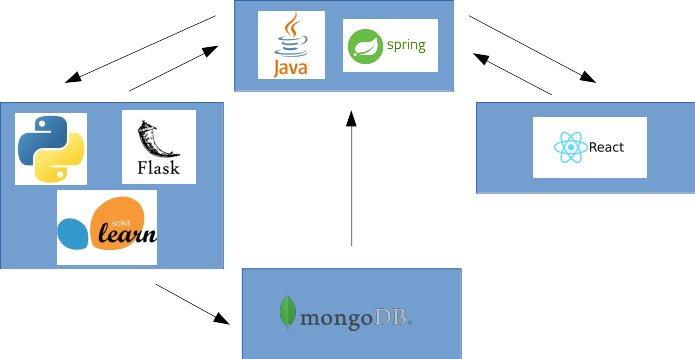
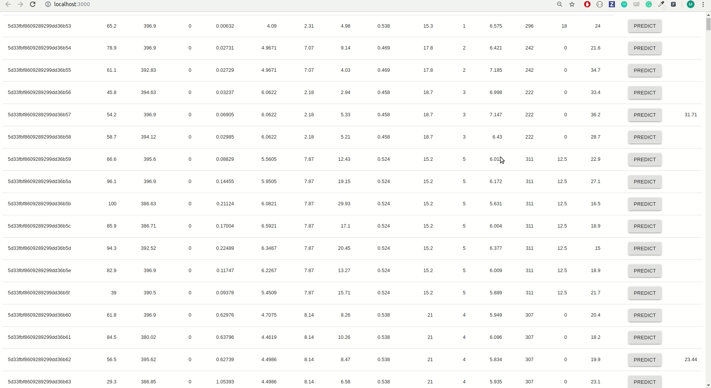

# house-predict
House price prediction application with `LinearRegression` trained on `sklearn.datasets.load_boston`

1) Start MongoDB
2) Load dataset to MongoDB with `load_data_to_mongo.ipynb`
3) Start `java-spring`
4) Start `flask-app.py`
5) Start `house-predict`
6) Click `predict` button to get predicted house price

Optional: You can play and analyze the data with `train.ipynb`

